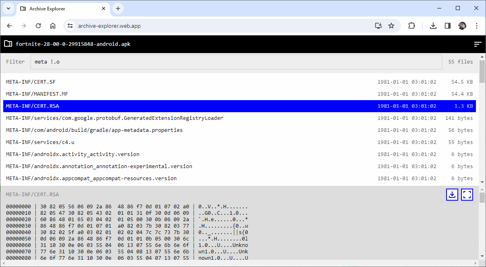

# Archive Explorer
Web application to read archive content recursively. 
Deployed version to try: [https://archive-explorer.web.app](https://archive-explorer.web.app/).

The application has been developed to open archives with gigabytes of content in tens of thousands of files and sub-archives.
It's easy to search files in the archive. There is the possibility of previewing content in text and binary formats.
Initial work was done to analyze huge technical logs. But in the end, it can be utilized for any purpose.

## Supported browsers
* Microsoft Edge
* Safari
* Mobile Safari
* Firefox
* Google Chrome
* Mobile Chrome

## Mobile version screenshots

## PC version screenshots

## Used libs
* https://react.dev
* https://stuk.github.io/jszip
* https://github.com/SteveSanderson/xzwasm
* https://github.com/InvokIT/js-untar
* https://github.com/nodeca/pako
